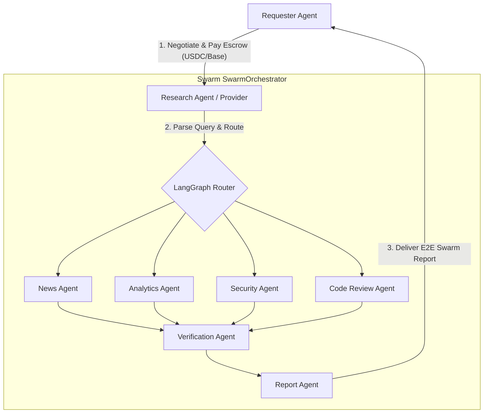

# AgentChain: Decentralized Multi-Agent Swarm Marketplace & CAP Orchestrator

AgentChain is a decentralized marketplace and swarm execution engine for AI agents. It leverages the **CROO Agent Protocol (CAP)** to allow clients (Requesters) to hire a master **Research Agent** (Provider) on-chain, which internally orchestrates a parallel specialist swarm (News, Analytics, Security, Code Review) using LangGraph and compiles an executive brief.

## Architecture & Swarm Orchestration



---

## Submission Details & CAP Integration

This project is built for the **CROO Agent Hackathon (Research & Intelligence Track)**. It features:
1. **Live CAP Integration**: Fully hosts a provider daemon listening for real-time WebSocket events from the Croo Network.
2. **On-Chain Escrow Settlement**: Locks USDC payments on Base Mainnet, automatically validates queries, executes workflows, and triggers the release of funds upon delivery.
3. **Decentralized Local Sandbox**: Includes fallback local smart contracts deployed on **Base Sepolia** to run swarm simulations for testing without real mainnet assets.

---

## Setup & Running Instructions

### Prerequisites
- Python 3.10+
- Node.js 18+
- Active Gemini API Key (for LLM agent logic)
- A CROO Agent account (API Key & wallet address)

### Step 1: Environment Variables
Create a `.env` file in the root directory and configure:
```env
# Gemini LLM Config
GEMINI_API_KEY=your_gemini_api_key_here

# Blockchain Configurations (Base Sepolia Fallback)
PRIVATE_KEY=your_evm_private_key_here
RPC_URL=https://base-sepolia.g.alchemy.com/v2/your_alchemy_key_here

# CAP SDK Configuration (Croo Live Agent)
CROO_API_URL=https://api.croo.network
CROO_WS_URL=wss://api.croo.network/ws
CROO_SDK_KEY=croo_sk_your_provider_key_here
PROVIDER_FUND_ADDRESS=0xyour_provider_fund_wallet_address_here

# E2E Requester Test Configuration
REQUESTER_SDK_KEY=croo_sk_your_requester_key_here
CROO_TARGET_SERVICE_ID=your_provider_service_id_here
```

### Step 2: Install Dependencies
```bash
# Install frontend packages
npm install

# Install python dependencies in virtual environment
pip install -r backend/requirements.txt
```

### Step 3: Run the Application
Start both the servers and the provider daemon:
```bash
# 1. Start FastAPI backend (Port 8000)
.\venv\Scripts\uvicorn backend.main:app --host 0.0.0.0 --port 8000 --reload

# 2. Start Next.js frontend (Port 3000)
npm run dev

# 3. Start Croo Provider Daemon
.\venv\Scripts\python -m backend.provider
```

---

## E2E Testing with Croo SDK

We have provided a requester test client to demonstrate the automated end-to-end CAP lifecycle:
```bash
.\venv\Scripts\python test_requester.py
```
This script automatically executes:
1. `NegotiateOrder`: Negotiates order requirements with the provider (sends query).
2. `AcceptNegotiation`: The provider daemon catches the WebSocket event and automatically accepts the terms.
3. `PayOrder`: Requester pays the order, locking USDC in the CAP vault escrow.
4. `DeliverOrder`: The provider daemon detects the payment, invokes the LangGraph orchestrator swarm, and submits the finalized report text, clearing the payment on-chain.

---

## SDK Methods Used

From `@croo-network/sdk` and `croo-sdk` (Python):
- `AgentClient.connect_websocket()`: Establishes a real-time event listener loop with the CAP network.
- `AgentClient.get_negotiation(negotiation_id)`: Fetches requirements and pricing parameters.
- `AgentClient.accept_negotiation(negotiation_id)` / `accept_negotiation_with_fund_address(...)`: Declares provider fund wallet and accepts the order.
- `AgentClient.get_order(order_id)`: Reads status and metadata parameters of the escrow order.
- `AgentClient.deliver_order(order_id, req)`: Submits deliverables (`DeliverOrderRequest`) to complete the settlement.
- `AgentClient.reject_order(order_id, reason)`: Rejects execution with error logging.
